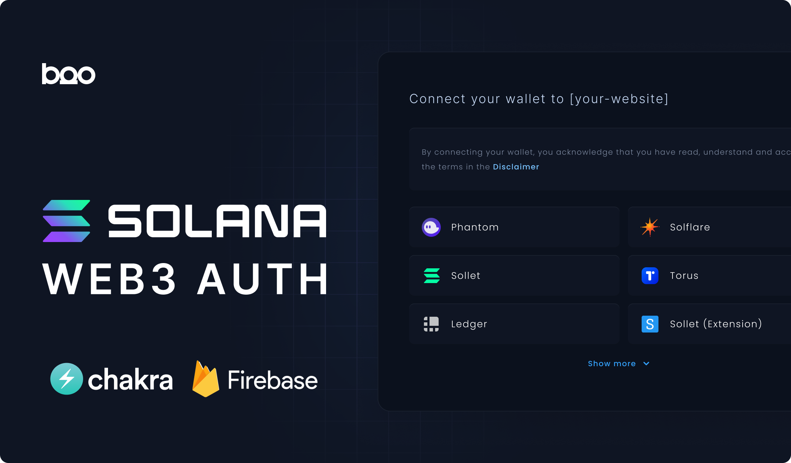

## Solana Authentication Guide

**Note**: This setup is actually from 2020-2021, but I only released it now because I've started focusing more on GitHub. Back in 2021, I used this setup to handle several thousand users every day without any problems. The setup was almost the same as it is now, except that it also had AppCheck. It's a basic setup, but it's flexible. Recently, Phantom has released the Solana Sign-in feature. It is probably the way to go in 2023. I suggest you check that out to handle sign-in. But our wallet adapter UI still looks better than the default one, though!

---

Before you start with this authentication template, make sure you've done the following:

### 1. Firestore Configuration
- Turn on Firestore in your Firebase project.

### 2. Anonymous Authentication
- Turn this on under `Authentication/Sign-in methods` in Firebase.

### 3. IAM Service Account Credentials
- You need to turn this on in your Firebase project.

### 4. AppEngine Permissions
- Assign the "Service Account Token Creator" role to the default compute service account. If you prefer to use 1st gen cloud functions, you should assign the "Service Account Token Creator" role to AppEngine. 

Note: In this demo, I used 2nd gen cloud functions. 

---

This example uses Firestore. But if you want other database options, think about **PlanetScale** or **Supabase**. Firestore can get expensive and might be easy to misuse. When working on web3, it's essential to protect against misuse.

This demo will teach you about nonce signing, signature verification, how to handle authentication, and set up a custom wallet adapter. Just remember, this template isn't bulletproof on security, so be careful.

---
